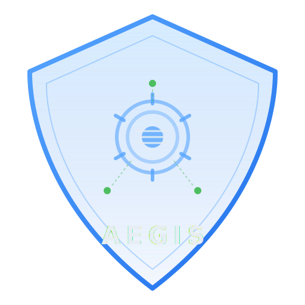

<p align="center">
  
</p>

<h1 align="center">Aegis</h1>

<p align="center">
  <strong>Dirmacs system configuration manager</strong><br>
  Rust CLI for dotfiles, config management, and OpenCode generation.
</p>

<p align="center">
  <a href="https://dirmacs.github.io/aegis">Documentation</a> &middot;
  <a href="https://github.com/dirmacs/aegis/issues">Issues</a>
</p>

---

## What is Aegis?

Aegis is a Rust CLI tool that manages system configurations from declarative TOML manifests. It replaces shell-script-based dotfile managers with a typed, modular, profile-aware approach — built specifically for the [dirmacs](https://github.com/dirmacs) ecosystem.

**Key features:**

- **Config management** — symlink, copy, or template-render configs to their targets
- **OpenCode generation** — typed TOML to `opencode.json` + `oh-my-opencode.json` with NVIDIA NIM support
- **Toolchain management** — install, update, and health-check ares, daedra, thulp, eruka, lancor
- **Profiles** — different module sets and variables per machine type
- **Drift detection** — diff and status commands show what's changed

## Encrypted Secrets

Aegis includes an encrypted vault for storing passwords, API keys, tokens, and other sensitive data.

### Commands

- `aegis secrets set <key> [value]` - Store a secret (prompts for value if omitted)
- `aegis secrets get <key>` - Retrieve a secret
- `aegis secrets list` - List all secret keys (not values)
- `aegis secrets rm <key>` - Delete a secret
- `aegis secrets export <key> [--env-name NAME]` - Output as `NAME=value` for shell sourcing

Example:
```bash
aegis secrets set github_token
aegis secrets export github_token --env-name GITHUB_TOKEN > .env
```

### Security

- **Encryption**: AES-256-GCM (authenticated)
- **Key derivation**: Argon2id (memory-hard, resistant to brute-force)
- **Storage**: Local-only at `~/.config/aegis/vault.toml`
- The vault is never committed to git and is deliberately excluded from the repository.

Because Aegis is an open-source public repository, the vault remains strictly on your local machine.
## Quick Start

```bash
# Install
cargo install aegis-cli

# Initialize a config repo
mkdir my-configs && cd my-configs
aegis init

# Check system status
aegis status

# Deploy configs
aegis link

# Generate OpenCode configs
aegis opencode generate

# Full bootstrap (packages + configs + verify)
aegis bootstrap
```

## Architecture

4-crate Rust workspace:

| Crate | Description |
|-------|-------------|
| `aegis-core` | Manifest parsing, module system, templates, diffing |
| `aegis-opencode` | Typed TOML to opencode.json + oh-my-opencode.json |
| `aegis-toolchain` | Dirmacs ecosystem install, update, health checks |
| `aegis-cli` | Clap-based CLI binary |

## CLI Commands

```
aegis init                          Initialize manifest
aegis bootstrap [--profile NAME]    Full system setup
aegis status [--json]               Health check
aegis link [--module NAME]          Deploy configs
aegis unlink [--module NAME]        Remove configs
aegis diff [--module NAME]          Show drift
aegis sync [--module NAME]          Capture live state
aegis opencode generate             Generate OpenCode JSON
aegis opencode validate             Validate TOML definitions
aegis toolchain install [TOOL]      Install dirmacs tools
aegis toolchain status              Show toolchain health
aegis toolchain update [TOOL]       Update tools
aegis profile list                  List profiles
aegis profile show NAME             Show profile details
```

## Dirmacs Ecosystem

| Tool | Role |
|------|------|
| [Ares](https://github.com/dirmacs/ares) | Agentic retrieval-enhanced server |
| [Daedra](https://github.com/dirmacs/daedra) | Web search MCP server |
| [Thulp](https://github.com/dirmacs/thulp) | Execution context engineering |
| [Eruka](https://eruka.dirmacs.com) | Context intelligence layer |
| [Lancor](https://github.com/dirmacs/lancor) | llama.cpp client library |
| **Aegis** | System configuration manager |

## License

MIT
